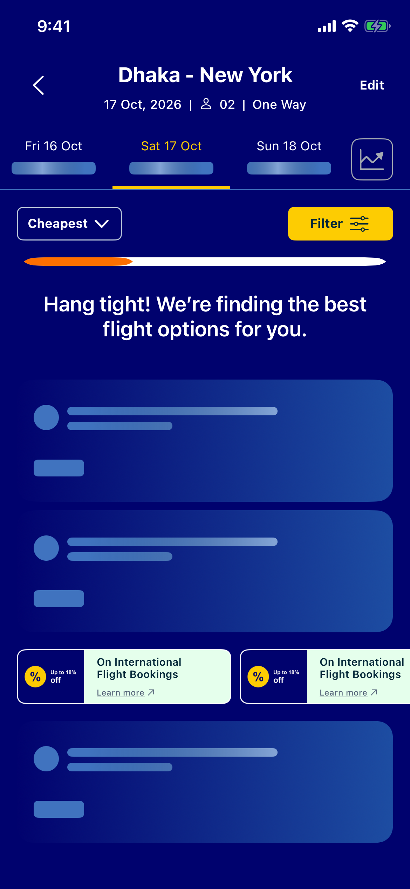
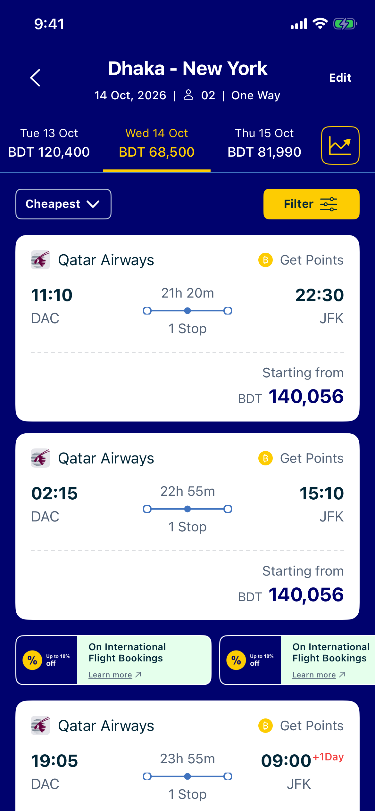
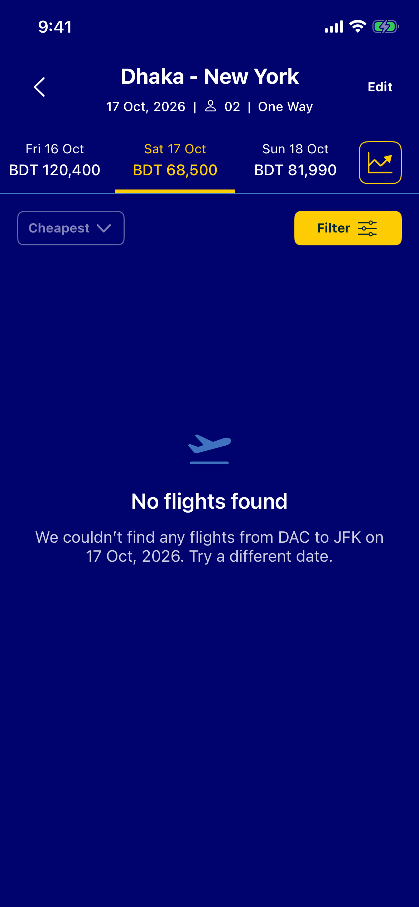
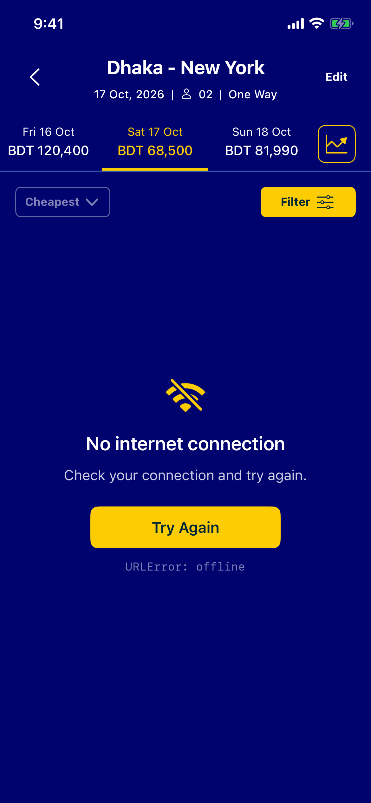

# FlightResults

A single-screen UIKit app for the GoZayaan iOS take-home: a flight results list in all four of its states, built on MVVM + Coordinator over the SerpApi Google Flights endpoint.

| Loading | Success | Empty | Error |
|---|---|---|---|
|  |  |  |  |

The sort dropdown is in [`docs/screenshots/sort.png`](docs/screenshots/sort.png).

## Setup

The app needs your own SerpApi key. It is never committed.

```bash
cp Config/Secrets.example.xcconfig Config/Secrets.xcconfig
# then edit Config/Secrets.xcconfig and replace the value:
# SERPAPI_API_KEY = your_key_here
```

Get a key at [serpapi.com/manage-api-key](https://serpapi.com/manage-api-key). `Config/Secrets.xcconfig` is git-ignored; `Base.xcconfig` includes it optionally, so the project still **builds without it** — the app then shows the "Search unavailable" error state rather than crashing or quietly serving fake data.

Open `FlightResults.xcodeproj` and run. Requires **iOS 18+**, Xcode with **Swift 6** language mode, iPhone portrait.

The search is hard-coded to DAC → New York (JFK), one way, 2 adults, departing 30 days from today.

## Schemes

Every state is reachable without waiting on the network:

| Scheme | What it does |
|---|---|
| `FlightResults` | Live SerpApi call. Debug builds cache responses on disk for 6 h to protect the free 100-search quota |
| `FlightResults (Fixture)` | A real captured SerpApi response bundled in the app, with a 1.5 s delay. Runs with no API key |
| `FlightResults (Loading)` | Stays in the loading state (skeletons, shimmer, progress bar) |
| `FlightResults (Empty)` | Empty state |
| `FlightResults (Error)` | Error state, with Try Again wired up |

The forced states are debug-only launch arguments (`-FRDataSource`, `-FRForceState`), read exclusively by `AppEnvironment`.

## Tests

```bash
xcodebuild test -scheme FlightResults -destination 'platform=iOS Simulator,name=iPhone 17e'
```

77 tests, none of which touch the network: SerpApi → `FlightOffer` mapping (including a 3-leg itinerary that must come out as "2 Stop"), strict decoding failures, HTTP and URL error classification, the disk cache, the ViewModel's state transitions, sorting, and the formatters. The app's own coordinators don't start during a test run, so a test never spends API quota.

## Architecture

```
SceneDelegate → AppCoordinator → FlightResultsCoordinator
                                   │ builds VM + VC, presents Safari
                                   ▼
        FlightResultsViewController  ←binds/intents→  FlightResultsViewModel
        UIKit only, no logic                         Foundation only
                                                       │
                                         FlightSearchService (protocol)
                                           SerpApiFlightSearchService
                                             ├ FlightsDataSource: Remote · Cached · Fixture
                                             ├ JSONDecoder → DTOs
                                             └ FlightOfferMapper → [FlightOffer]
```

- **ViewModel** holds `loading / success / empty / error`, makes the call, sorts, and formats ViewData. It imports Foundation only — no UIKit, no `SafariServices`, no knowledge of the Coordinator — and reports events through a weak `FlightResultsCoordinatorDelegate`.
- **Views** render already-formatted strings; no formatting, sorting or networking happens in a cell.
- **Coordinator** owns navigation, and is the only place that touches `SFSafariViewController` (Learn more → gozayaan.com, the one real navigation in the task).
- **Composition root** (`AppEnvironment`) is the only place that reads launch arguments and picks implementations.

Full detail lives in [`/spec`](spec), written before any code: states, data mapping, architecture, UI measurements, acceptance criteria and the step-by-step build plan. [`NOTES.md`](NOTES.md) records the AI tooling, every correction made along the way, and which decisions were mine.

## Known limitations

- **The API key ships inside the app.** Any key in a binary can be extracted; in production this call belongs behind a GoZayaan backend proxy (D-07).
- **BDT prices are converted with a fixed rate, not live FX.** SerpApi rejects `currency=BDT` (HTTP 400 — it isn't in their Google Travel currency list), so the wire request always asks for USD and the service converts with a hard-coded rate before the ViewModel sees it. The UI stays in BDT because that's the design and GoZayaan's market (D-06).
- **Date-strip fares and the promo cards are dummy data**, hard-coded as the brief asks. Tapping a date chip does nothing.
- **Decorative controls:** Edit, back, Filter, the price-trend chart button and "Get Points" are present to match the brief and design, and deliberately do nothing.
- **No Dynamic Type.** The card layout is measured at fixed sizes; VoiceOver is supported through combined labels (D-28).
- Promo artwork is original, not taken from the design file.
